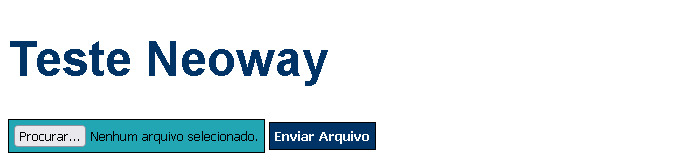

# Teste Neoway :globe_with_meridians:

## Serviço de manipulação de dados e persistência em base de dados.

## Tecnologias usadas:
 * Golang
 * Postgres
 * HTML
 * CSS
 * Javascript

## Instruções de uso

1. Antes certifique-se que tenha o Docker instalado em sua maquina.
2. Baixe ou clone o projeto.
3. Acesse a pasta raiz do projeto pelo prompt de comando ou terminal, em seguida digite "docker-compose up" e aguarde a inicialização do programa. 
4. Após a inicialização do container acesso o endereço "http://localhost:4500" para acessar a seguinte pagina;
   
5. Clique no botão procurar para selecionar o arquivo a ser carregado;
6.  Após a seleção do arquivo clique no botão "Enviar Arquivo" e aguarde a persistência dos dados no banco;
   
7. Para visualizar os dados acesse o container "neoway" na interface do Docker, em seguida acesso o terminal CLI do container "bd_postgres" como na imagem a baixo;
   
8. Acesso o banco de dados com o seguinte comando "psql -U postgres -d neoway";
9. Para verificação dos dados digite a query "select * from tb_dados_compra limit 10;"

### A tabela ("tb_dados_compra") segue a seguinte estrutura: 

	create table if not exists tb_dados_compra (
		cpf double precision not null,
		private int,
		incompleto int,
		data_ultima_compra date null,
		ticket_medio numeric null,
		ticket_ultima_compra numeric null,
		loja_mais_frequente double precision null,
		loja_ultima_compra double precision null
	);

Entre em contato: https://www.linkedin.com/in/mac-mohammed-alves-dos-santos-00037423/ or macmohammed@gmail.com